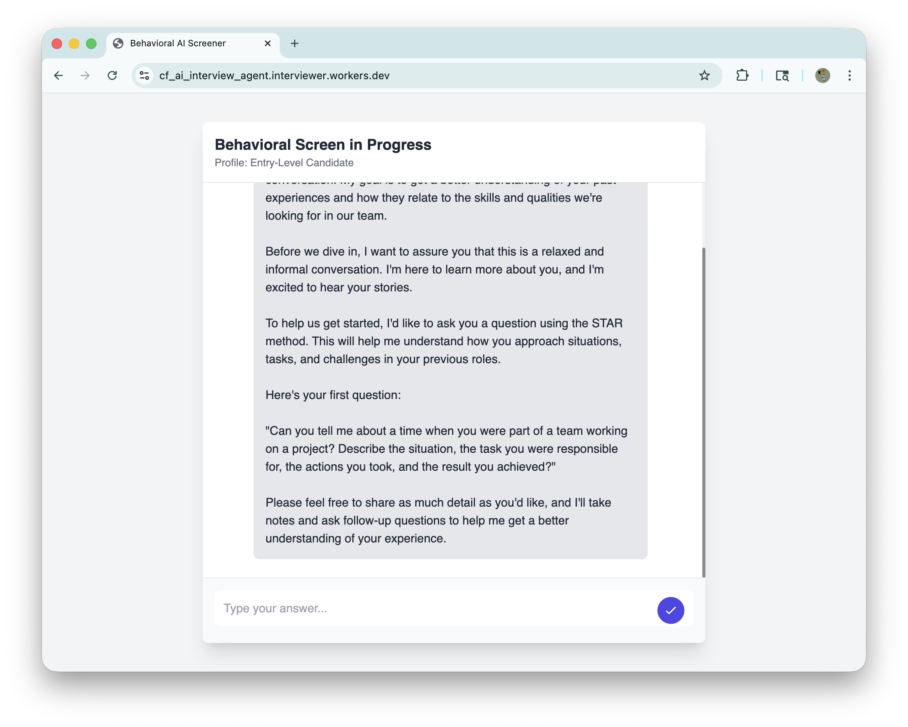
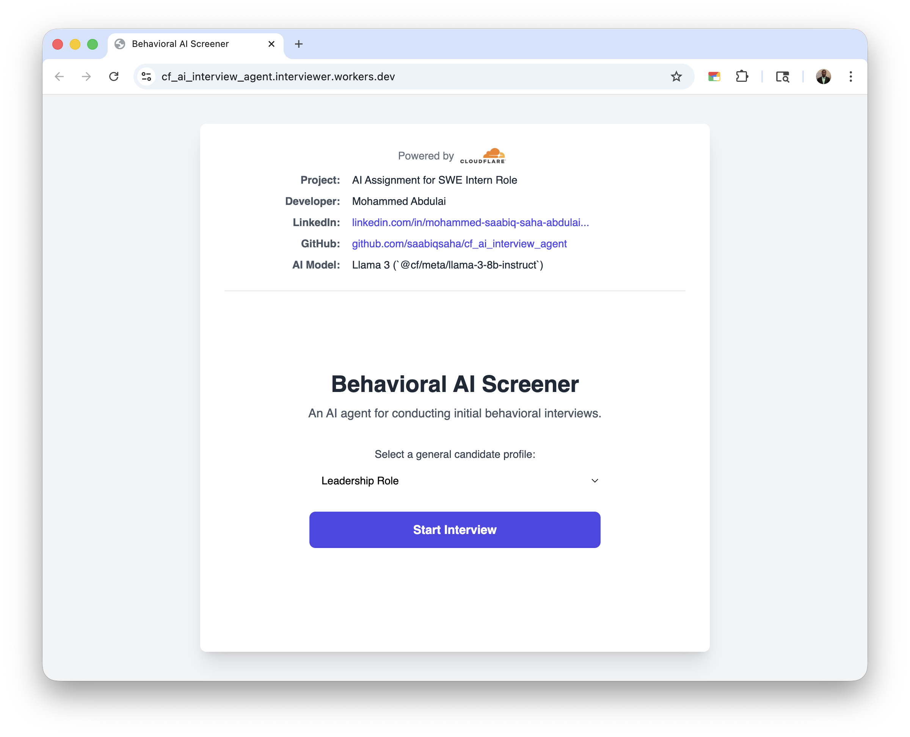

# AI Interview Agent

[](https://cf_ai_interview_agent.interviewer.workers.dev)
[](https://workers.cloudflare.com)

**Real-time AI interviewer that conducts personalized technical interviews with instant feedback and comprehensive scoring.**

## 🎯 Features

- **Dynamic Question Generation** - AI creates role-specific questions based on position and resume
- **Real-time Feedback** - Instant scoring and constructive feedback after each response
- **Session Persistence** - Maintains conversation context throughout the interview
- **Comprehensive Reports** - Detailed performance analysis and recommendations

## 📸 Screenshots

<div align="center">

### Interview Interface


### Cloudflare Dashboard


</div>

## 🛠️ Architecture

- **🧠 LLM**: Cloudflare Workers AI (`@cf/meta/llama-3-8b-instruct`)
- **⚙️ Workflow**: Cloudflare Worker handles routing and API logic
- **💬 Frontend**: Static HTML/JS served via Cloudflare Pages
- **💾 State**: Durable Objects manage conversation memory and session data

## 🚀 Quick Start

```bash
# Clone repository
git clone https://github.com/saabiqsaha/cf_ai_interview_agent.git
cd cf_ai_interview_agent

# Install dependencies
npm install

# Run locally
wrangler dev --local
```

Open `http://localhost:8787` in your browser.

## 💡 How It Works

1. **Setup** → Enter your details and target position
2. **Interview** → AI asks tailored questions one at a time
3. **Feedback** → Get instant scoring and improvement suggestions
4. **Report** → Receive comprehensive performance analysis

## 🎯 Use Cases

- **Job Seekers** - Practice interviews with AI feedback
- **Recruiters** - Streamline initial candidate screening
- **Companies** - Standardize technical assessment process

## 👨‍💻 Developer

**Mohammed Saabiq Saha Abdulai**

[](https://www.linkedin.com/in/mohammed-saabiq-saha-abdulai-099b00257/)
[](https://github.com/saabiqsaha)

---

<div align="center">
<i>Built with Cloudflare's edge computing platform for global performance and scalability.</i>
</div>
